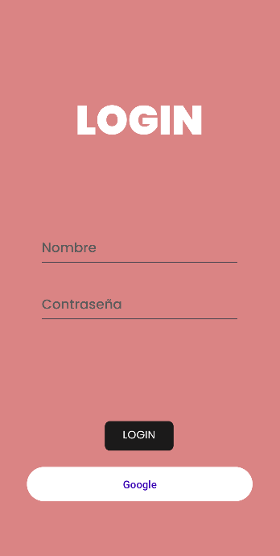

## Proyecto

Proyecto de android que hace un CRUD con una api de gestión de productos.

## Login de Google 

Pasos para crear el proyecto de google(seguido pasos curso mouredev)

1.- Crear proyecto en firebase y obtener el JSON con los datos.
2.- Obtener el ServerClientID de google cloud.
3.- Seguir el curso para implementar la lógica en el proycto

## Dependencias para Login de Google 

1.- Añadir plugin de google en el build.gradle a nivel de proyecto

2.- A nivel de app tienes que implementar 3 códigos que te dice el Firebase para implementar el login
.

## Dependencias para el consumo de la api

Estas se encuentran en el buid.gradle a nivel de aplicación.

## Login

Esta es la pantalla del login

En el podemos ver el titulo, 2 campos de texto para introducir el usuario y la contraseña con su respectivo boton para el inicio de sesión y aparte el botón para el inicio de sesión con google

# CRUDInterfaces

## Home

La pantalla home es la que hace un getAll a la api.

Es un listview donde se van introduciendo todos los productos junto a todos sus datos, esto es gracias un CustomAdapter que utilizando un xml da formato a las cards.

## ADD

La pantalla Add es la que permite introducir nuevos productos.

Tiene todos los texBox necesarios para introducir un nuevo producto

## Update

La pantalla update es la que permite cambiar datos de los productos.

Tiene todos los texBox necesarios para poder actualizar los productos

## Delete

La pantalla delete contiene una versión simplificada del listView de la ventana home pero la cual se le puede hacer click, al pulsar un producto este se elimina.

## Salir

El 5º botón del menú es para salir de la aplicación y te vuelve a la ventana de login

# API

La api es una api de springBoot con una base de datos h2 para la gestión de productos.

## Endpoints

### Obtener todos los Producto

- **URL**
  `/producto`
  
- **Método HTTP**
  `GET`
  Contenido: Lista de objetos `Producto`

### Obtener Producto por ID

- **URL**
  `/Producto/{id}`
  
- **Método HTTP**
  `GET`
  
- **Parámetros de Ruta**
  `id` (int): ID del Producto

  Contenido: Objeto `Player`

### Añadir un Producto

- **URL**
  `/Producto`
  
- **Método HTTP**
  `POST`
  
- **Cuerpo de la Solicitud**
  Objeto `ProductoDTO`
  
  Contenido: Objeto `Producto` recién añadido

### Actualizar un jugador

- **URL**
  `/Producto/{id}`
  
- **Método HTTP**
  `PUT`
  
- **Parámetros de Ruta**
  `id` (int): ID del Producto
  
- **Cuerpo de la Solicitud**
  Objeto `ProductoDTO`
  
  Contenido: Objeto `Producto` actualizado

### Borrar un Producto

- **URL**
  `/Producto/{id}`
  
- **Método HTTP**
  `DELETE`
  
- **Parámetros de Ruta**
  `id` (int): ID del Producto
  
  Contenido: Objeto `Producto` borrado
